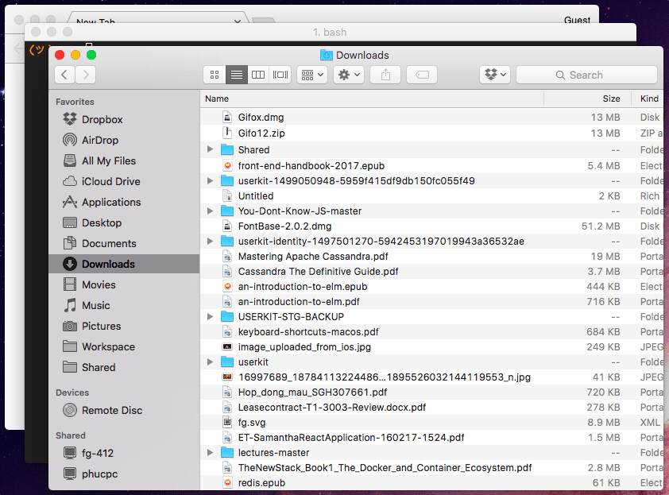

# Local share
Serve your shared folder in OSX (with auto copy-to-clipboard your local address) (because I don't like AirDrop)

## Usage



* Clone the project
* `cd` and run `npm install -g`
* Configure default shared directory and port
```
$ localshare config -d /path/to/your/shared/dir -p 8888
```
* Start the service
```
$ localshare start -d /path/to/another/shared/dir
```
* Share one file
```
$ localshare start -d /path/to/your/file
```
